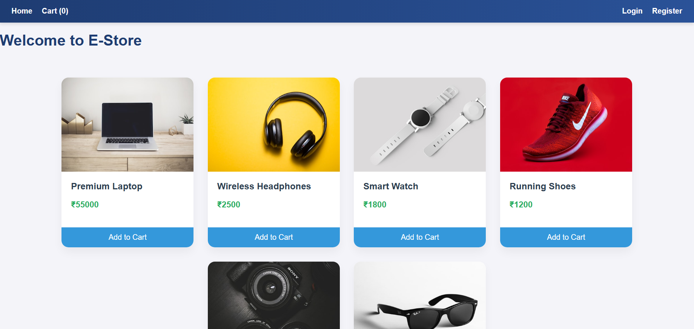
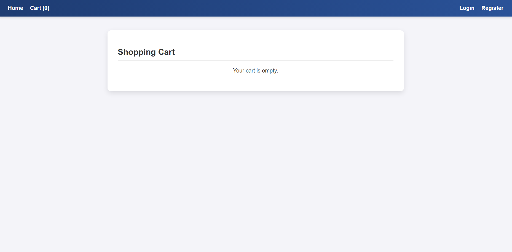
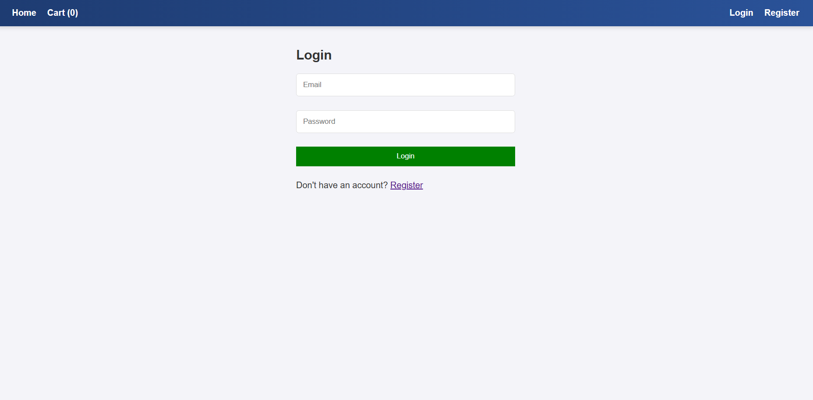
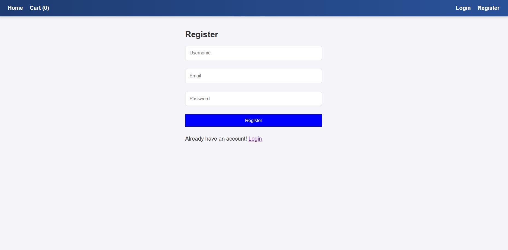

# 🛍️ E-Commerce Store (MERN Stack)

This is a Full-Stack E-Commerce Application built as part of the **Advanced Stage - Task 1** for the Full Stack Developer Internship at **Cognetix Technology**.

The application allows users to browse products, manage a shopping cart, and place orders with secure user authentication.

---

## 🚀 Features

* **User Authentication:** Secure Registration and Login using JWT & Bcrypt.
* **Product Catalog:** Browse various products dynamically fetched from the database.
* **Shopping Cart:**
    * Add items to the cart.
    * View cart count in real-time on the Navbar.
    * Remove items and view total price.
* **Secure Checkout:** Ensures the user is logged in before placing an order.
* **Responsive Design:** Fully responsive UI for Desktop and Mobile devices.
* **Backend API:** RESTful API built with Node.js & Express.

---

## 🛠️ Tech Stack Used

* **Frontend:** React.js, Context API, CSS (Responsive)
* **Backend:** Node.js, Express.js
* **Database:** MongoDB
* **Authentication:** JSON Web Tokens (JWT)

---

## 📂 Project Structure
    Cognetix_EcommerceStore/ 
    ├── client/ # Frontend (React App)
    └── server/ # Backend (Node.js API)

---

## ⚙️ Installation & Run Guide

Follow these steps to run the project locally.

### 1. Clone the Repository
```bash
git clone [https://github.com/RaviKumar-8/Cognetix_EcommerceStore.git](https://github.com/RaviKumar-8/Cognetix_EcommerceStore.git)
cd Cognetix_EcommerceStore
```
### 2. Backend Setup (Server)
Open a terminal for the server:

```Bash

cd server
npm install
```
* Create a .env file in the server folder (optional, or update server.js directly):

```Code snippet

MONGO_URI=mongodb://127.0.0.1:27017/cognetix_ecommerce
JWT_SECRET=your_secret_key
```
* Start the Server:

```Bash

node server.js
```
(Server runs on http://localhost:5000)

### 3. Frontend Setup (Client)
Open a new terminal for the client:

```Bash

cd client
npm install
npm start
```
(Client runs on http://localhost:3000)

---

## 📸 Screenshots (Optional)
### Home Page:

### Cart Page: 

### Login Page:

### Register Page:

---

## 👤 Author
**Ravi Kumar**

**Role:** Full Stack Developer Intern

**GitHub:** ravikumar-8

## 🙏 Acknowledgments
Thanks to Cognetix Technology for providing this opportunity to learn and build real-world applications.
